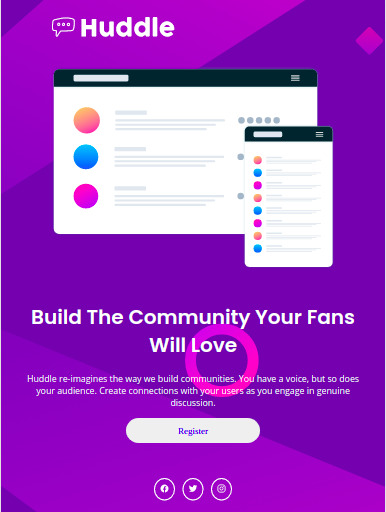

# landingPageChallenge

link: https://motagabriel.github.io/fmlandingpage.github.io/

## 🚀 O desafio consistia em fazer uma landing Page, utilizando css puro, para desktop e mobile

### - 💻 Desktop

<h3 align="center">
  
</h3>

### - 📱📱 Ipad

<h3 align="center">
  
</h3>

### - 📱 Mobile

<h3 align="center">
  
</h3>

## 	

### 👇 Créditos
[Frontend Mentor](https://www.frontendmentor.io) challenges help you improve your coding skills by building realistic projects.
